### Tech Stack
- Clerk (for authentication)
- NextJS (as a fullstack framework)
- Prisma (Object Relational Mapper)
- NeonDB (as a Database Provider)
- Postgresql (database)
- Tailwind CSS (for styling)
- ShadCN (for styling)
- tRPC (End-to-end typesafe APIs for connecting frontend to backend)
- stripe (for payment)
- TypeScript
- Vercel (for deployment)
- OpenAI (for AI composing features)
- orama (for full text search)
- aurinko

### What I've learned through this project
1. RAG pipeline with custom chatbot
2. Full text search
3. Full email client clone (syncing email, sending and receiving, composing etc)
4. AI smart compose (email writing copilot)
5. Command K command bar
6. Stripe payment setup (SaaS subscription service)

### Tutorial Flow
1. Understand email client functionality with Aurinko
2. Set up NextJS, ShadCN, Clerk and Database
3. Prepare Aurinko API to receive and sync emails
4. Also do database engineering & webhook management
5. Hook up full text search with Orama
6. Hook up initial UI to display emails & threads
7. Search UI
8. RAG pipline QnA with Vercel AI SDK
9. Replies and Composing with Copilot
10. Stripe setup
11. Deploy to Vercel
12. Landing page

### Understanding of Aurinko 

```mermaid
graph TD
    %% Email Providers
    subgraph Email_Providers[Email Providers]
        A["john&#64;gmail.com"]
        C["jane&#64;outlook.com"]
    end

    %% Processing
    subgraph Processing[Aurinko Processing]
        B[Aurinko]
        F["authorise access<br/>sync emails<br/>send emails"]
    end

    %% Application
    subgraph App[Our Application]
        D[Application Backend]
        E[(Database)]
        G["save account details<br/>save user details<br/>save emails & threads"]:::note
    end

    %% Connections
    A --> B
    C --> B
    B --> F
    F --> D
    D --> E
    E --- G

    %% Styling
    style Email_Providers fill:#e8f0fe,stroke:#3367d6,stroke-width:2px
    style Processing fill:#fff3e0,stroke:#ff9800,stroke-width:2px
    style App fill:#e8f5e9,stroke:#388e3c,stroke-width:2px
    style E fill:#fff,stroke:#000,stroke-width:1px

    %% Note Styling
    classDef note fill:#fff3cd,stroke:#ff9800,stroke-width:1px;
```

### Initial Onboarding Process

```mermaid
flowchart TD
    %% Gmail server
    GMAIL["john&#64;gmail.com<br/>Gmail Server"]

    %% Aurinko
    AURINKO["Aurinko"]

    %% User & Application
    USER["User<br/>Our Application"]
    CALLBACK["/api/aurinko/callback/"]

    %% Tables
    ACCOUNT_TABLE["Account Table<br/>id | accountId | token | address"]
    EMAIL_TABLE["Email Table<br/>id | subject | body | from | etc."]

    %% Steps
    GMAIL --> |"inbox: messages/threads"| USER
    USER --> |"step 1: grant access to aurinko"| AURINKO
    AURINKO --> |"step 2: sends token + email info"| USER
    USER --> |"step 3: save to db"| ACCOUNT_TABLE
    AURINKO --> |"api.aurinko.com/email/sync<br/>accountId: 06498<br/>token: token-abcdef"| USER
    USER --> |"step 4: use token to sync inbox"| EMAIL_TABLE

    %% Relationships between tables
    ACCOUNT_TABLE --> EMAIL_TABLE


```
